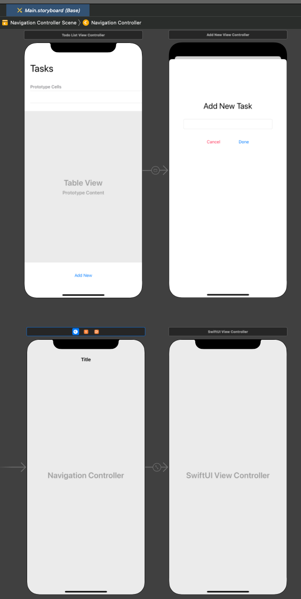
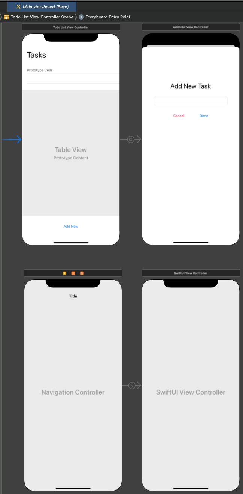

# Combine ToDo List app

This project is a study of the Combine framework, implementing the functionality of the app integrating Combine with both UIKit and SwiftUI frameworks, and showing its differences.

## Starting the app

### SwiftUI
To run the app using the SwiftUI views, on the `Main.storyboard` file move the Storyboard entrypoint to the navigation controller as the image

### UIKit
To run the app using the UIKit views, on the `Main.storyboard` file move the Storyboard entrypoint to the ToDoListViewController as the image

